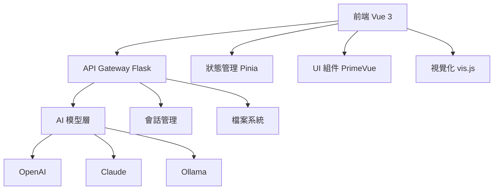

# HAAAI Social Scribe - 開發者完整指南

> 社工訪視報告自動生成系統完整技術文檔

## 📋 目錄

1. [專案概述](#1-專案概述)
2. [前端架構](#2-前端架構)
3. [後端架構](#3-後端架構)
4. [核心功能模組](#4-核心功能模組)
5. [開發環境設定](#5-開發環境設定)
6. [API 整合](#6-api-整合)
7. [部署指南](#7-部署指南)
8. [開發工作流程](#8-開發工作流程)
9. [故障排除](#9-故障排除)

---

## 1. 專案概述

### 1.1 專案目的

HAAAI Social Scribe 是一個基於 AI 的社工訪視報告自動生成系統，旨在協助社工師快速將訪談逐字稿轉換為結構化的專業報告。

**核心價值：**
- 🚀 **效率提升**: 將耗時數小時的報告撰寫縮短至分鐘級別
- 🎯 **專業標準**: 確保報告符合社工專業規範和格式要求
- 🤖 **AI 輔助**: 結合多種 LLM 模型提供智能化處理
- 📊 **視覺化**: 自動生成人物關係圖輔助理解

### 1.2 主要功能

| 功能模組 | 描述 | 技術實現 |
|---------|------|----------|
| 逐字稿處理 | 支援音檔和文字檔上傳，提供編輯界面 | Vue 3 + TypeScript |
| AI 報告生成 | 多步驟 AI 處理，生成結構化報告 | Flask + OpenAI/Claude |
| 人物關係圖 | 自動識別人物關係並視覺化呈現 | vis.js + AI 解析 |
| 處遇計畫 | 結構化的處遇計畫編輯器 | Vue 組件 + AI 輔助 |
| 會話管理 | 多會話並行處理，自動狀態保存 | Pinia + 後端會話管理 |

### 1.3 技術架構總覽



---

## 2. 前端架構

### 2.1 技術棧

```json
{
  "framework": "Vue 3.4.21",
  "language": "TypeScript 5.0.2",
  "build": "Vite 6.3.5",
  "ui": "PrimeVue 3.53.1",
  "styling": "Tailwind CSS 3.4.3",
  "state": "Pinia 2.1.7",
  "router": "Vue Router 4.3.0"
}
```

### 2.2 專案結構

```
frontend/src/
├── 📁 components/          # 可重用組件
│   ├── 📁 Banner/         # 檔案上傳相關組件
│   │   ├── BannerUpload.vue      # 主要上傳界面
│   │   ├── SecurityGuideDialog.vue  # 安全指南對話框
│   │   └── UserGuideDialog.vue     # 使用指南對話框
│   ├── 📁 Dashboard/      # 主控台組件
│   │   └── DashboardPanel.vue      # 分頁式主控台
│   ├── 📁 PersonGraph/    # 人物關係圖組件
│   │   ├── PersonGraphChat.vue     # 關係圖對話編輯
│   │   ├── PersonGraphEditor.vue   # 關係圖編輯器
│   │   ├── PersonGraphViewer.vue   # 關係圖檢視器
│   │   └── 📁 vis-network/        # vis.js 封裝
│   ├── 📁 ReportConfig/   # 報告設定組件
│   │   └── ReportConfigPanel.vue   # 報告參數設定
│   ├── 📁 ReportSession/  # 報告顯示組件
│   │   └── ReportEditor.vue        # 報告編輯器
│   ├── 📁 TreatmentPlan/  # 處遇計畫組件
│   │   └── TreatmentPlanEditor.vue # 處遇計畫編輯器
│   └── 📁 TypescriptEditor/ # 逐字稿編輯
│       └── TypescriptEditor.vue    # 逐字稿編輯器
├── 📁 stores/             # Pinia 狀態管理
│   ├── useSessionStore.ts          # 主要會話狀態
│   ├── useModularSessionStore.ts   # 模組化會話管理
│   └── 📁 modules/        # 功能模組狀態
│       ├── navigationStore.ts      # 導航狀態
│       ├── personGraphStore.ts     # 人物關係圖狀態
│       ├── reportStore.ts          # 報告狀態
│       ├── transcriptStore.ts      # 逐字稿狀態
│       └── treatmentPlanStore.ts   # 處遇計畫狀態
├── 📁 router/             # Vue Router 路由
├── 📁 views/              # 頁面組件
├── 📁 utils/              # 工具函數
└── 📁 assets/             # 靜態資源
```

### 2.3 核心組件詳解

#### 2.3.1 BannerUpload 組件

**功能**: 檔案上傳和初始設定

```vue
<template>
  <div class="upload-container">
    <!-- 檔案上傳區域 -->
    <div class="upload-area" @drop="handleDrop" @dragover.prevent>
      <input type="file" @change="handleFileSelect" />
    </div>
    
    <!-- 使用指南 -->
    <UserGuideDialog v-model:visible="showGuide" />
    
    <!-- 安全指南 -->
    <SecurityGuideDialog v-model:visible="showSecurity" />
  </div>
</template>

<script setup lang="ts">
// 檔案處理邏輯
const handleFileSelect = (event: Event) => {
  const file = (event.target as HTMLInputElement).files?.[0]
  if (file) {
    sessionStore.setAudioFile(file)
  }
}
</script>
```

#### 2.3.2 DashboardPanel 組件

**功能**: 統一的分頁式工作界面

```vue
<template>
  <TabView>
    <TabPanel header="逐字稿編輯">
      <TypescriptEditor />
    </TabPanel>
    
    <TabPanel header="報告生成">
      <ReportEditor />
    </TabPanel>
    
    <TabPanel header="人物關係圖">
      <PersonGraphEditor />
    </TabPanel>
    
    <TabPanel header="處遇計畫">
      <TreatmentPlanEditor />
    </TabPanel>
  </TabView>
</template>
```

#### 2.3.3 PersonGraphEditor 組件

**功能**: 人物關係圖編輯和視覺化

```vue
<template>
  <div class="flex gap-4">
    <!-- 左側：關係圖顯示 -->
    <div class="flex-1">
      <PersonGraphViewer graph-type="person" />
    </div>
    
    <!-- 右側：AI 對話編輯 -->
    <div class="flex-1">
      <PersonGraphChat graph-type="person" />
    </div>
  </div>
</template>
```

### 2.4 狀態管理架構

#### 2.4.1 主要 Store 結構

```typescript
// useSessionStore.ts - 核心會話狀態
export const useSessionStore = defineStore('session', () => {
  // 基本狀態
  const sessionId = ref('')
  const audioFile = ref<File | null>(null)
  const transcriptText = ref('')
  const reportText = ref('')
  
  // 報告設定
  const reportConfig = ref<ReportConfig>({
    template: '通用社工評估報告',
    selectedSections: [],
    customSettings: {}
  })
  
  // 步驟管理
  const currentStep = ref(0)
  const stepValidation = ref([false, false, false, false])
  
  // Actions
  const setTranscriptText = (text: string) => {
    transcriptText.value = text
  }
  
  const setReportText = (text: string) => {
    reportText.value = text
  }
  
  return {
    // State
    sessionId, audioFile, transcriptText, reportText,
    reportConfig, currentStep, stepValidation,
    
    // Actions
    setTranscriptText, setReportText
  }
}, {
  persist: {
    storage: localStorage,
    paths: ['sessionId', 'transcriptText', 'reportText', 'reportConfig']
  }
})
```

#### 2.4.2 模組化狀態管理

```typescript
// personGraphStore.ts - 人物關係圖狀態
export const usePersonGraphStore = defineStore('personGraph', () => {
  const personGraphJson = ref('')
  const personGraphStage = ref<'idle' | 'generating' | 'done' | 'error'>('idle')
  
  const hasPersonGraph = computed(() => !!personGraphJson.value)
  const isPersonGraphGenerating = computed(() => personGraphStage.value === 'generating')
  
  function setPersonGraphJson(json: string) {
    personGraphJson.value = json
  }
  
  function setPersonGraphStage(stage: 'idle' | 'generating' | 'done' | 'error') {
    personGraphStage.value = stage
  }
  
  return {
    personGraphJson, personGraphStage,
    hasPersonGraph, isPersonGraphGenerating,
    setPersonGraphJson, setPersonGraphStage
  }
})
```

---

## 3. 後端架構

### 3.1 技術棧

```python
# requirements.txt
Flask==3.0.0           # Web 框架
openai==1.3.0          # OpenAI API
anthropic==0.52.2      # Claude API
ollama==0.1.7          # Ollama 本地模型
flask-cors==4.0.0      # CORS 支援
```

### 3.2 專案結構

```
backend/
├── 📄 app.py                    # Flask 主應用
├── 📁 api/                     # API 路由模組
│   ├── report_routes.py        # 報告生成 API
│   ├── graph_routes.py         # 人物關係圖 API
│   └── treatment_routes.py     # 處遇計畫 API
├── 📁 prompt_core/            # 核心 Prompt 管理
│   ├── chat.py                # LLM API 封裝
│   └── prompt.py              # Prompt 模板管理
├── 📁 utils/                  # 工具模組
│   ├── session_manager.py     # 會話管理
│   └── file_manager.py        # 檔案管理
├── 📁 temp_sessions/          # 暫存會話目錄
├── 📄 run.py                  # 報告生成主流程
├── 📄 person_graph.py         # 人物關係圖生成
├── 📄 person_graph_chat.py    # 人物關係圖對話
├── 📄 *.json                  # 配置檔案
└── 📄 setting.json            # LLM 模型設定
```

### 3.3 API 路由設計

#### 3.3.1 Flask 應用初始化

```python
# app.py
from flask import Flask
from flask_cors import CORS
from api.report_routes import report_bp
from api.graph_routes import graph_bp
from api.treatment_routes import treatment_bp

app = Flask(__name__)
CORS(app)

# 註冊藍圖
app.register_blueprint(report_bp)
app.register_blueprint(graph_bp)
app.register_blueprint(treatment_bp)

@app.route('/api/health', methods=['GET'])
def health_check():
    return {'status': 'healthy', 'message': 'API is running'}

if __name__ == '__main__':
    app.run(host='0.0.0.0', port=5353, debug=True)
```

#### 3.3.2 報告生成 API

```python
# api/report_routes.py
from flask import Blueprint, request, Response
import subprocess
import sys

report_bp = Blueprint('report', __name__)

@report_bp.route('/api/run', methods=['POST'])
def run_report():
    """社工報告生成 API"""
    data = request.get_json()
    
    def generate():
        # 寫入輸入檔案
        input_file = session_manager.get_step_specific_file_path(
            session_id, 'report', 'input'
        )
        with open(input_file, 'w', encoding='utf-8') as f:
            f.write(data['text'])
        
        # 執行報告生成腳本
        process = subprocess.Popen([
            sys.executable, 'run.py',
            '--session-id', session_id,
            '--input-file', input_file,
            '--config-file', config_file
        ], stdout=subprocess.PIPE, stderr=subprocess.PIPE, text=True)
        
        # 流式輸出
        for line in process.stdout:
            yield line
        
        process.stdout.close()
        process.wait()
    
    return Response(generate(), mimetype='application/x-ndjson')
```

#### 3.3.3 人物關係圖 API

```python
# api/graph_routes.py
@graph_bp.route('/api/PersonGraph', methods=['POST'])
def run_person_graph():
    """人物關係圖生成 API"""
    data = request.get_json()
    text = data.get('text', '')
    session_id = data.get('sessionId', str(uuid.uuid4()))
    
    def generate():
        print(f"收到人物關係圖請求，會話ID: {session_id}")
        
        # 準備輸入檔案
        input_file = session_manager.get_step_specific_file_path(
            session_id, 'person_graph', 'input'
        )
        with open(input_file, 'w', encoding='utf-8') as f:
            f.write(text)
        
        # 執行人物關係圖生成腳本
        process = subprocess.Popen([
            sys.executable, 'person_graph.py',
            '--session-id', session_id,
            '--input-file', input_file,
            '--config-file', 'person_graph.json'
        ], stdout=subprocess.PIPE, stderr=subprocess.PIPE, text=True)
        
        for line in process.stdout:
            yield line
        process.stdout.close()
        process.wait()
    
    return Response(generate(), mimetype='application/x-ndjson')

@graph_bp.route('/api/PersonGraphChat', methods=['POST'])
def person_graph_chat():
    """人物關係圖對話編輯 API"""
    data = request.get_json()
    message = data.get('message', '')
    current_graph = data.get('currentGraph', '')
    transcript = data.get('transcript', '')
    session_id = data.get('sessionId', str(uuid.uuid4()))
    
    def generate():
        # 準備對話輸入
        input_file = session_manager.get_step_specific_file_path(
            session_id, 'person_graph_chat', 'input'
        )
        with open(input_file, 'w', encoding='utf-8') as f:
            f.write(f"原始逐字稿:\n{transcript}\n\n當前人物關係圖JSON:\n{current_graph}\n\n用戶指令:\n{message}")
        
        # 執行對話處理腳本
        process = subprocess.Popen([
            sys.executable, 'person_graph_chat.py',
            '--session-id', session_id,
            '--input-file', input_file,
            '--message', message,
            '--current-graph', current_graph or '{}',
            '--transcript', transcript,
            '--graph-type', 'person',
            '--config-file', 'person_graph_chat.json'
        ], stdout=subprocess.PIPE, stderr=subprocess.PIPE, text=True)
        
        for line in process.stdout:
            yield line
        process.stdout.close()
        process.wait()
    
    return Response(generate(), mimetype='application/x-ndjson')
```

### 3.4 會話管理系統

```python
# utils/session_manager.py
import os
import shutil
from pathlib import Path

class SessionManager:
    def __init__(self, base_dir='temp_sessions'):
        self.base_dir = Path(base_dir)
        self.base_dir.mkdir(exist_ok=True)
    
    def get_session_dir(self, session_id: str) -> Path:
        """獲取會話目錄"""
        session_dir = self.base_dir / session_id
        session_dir.mkdir(exist_ok=True)
        return session_dir
    
    def get_step_specific_file_path(self, session_id: str, step: str, file_type: str) -> str:
        """獲取步驟專用檔案路徑"""
        session_dir = self.get_session_dir(session_id)
        timestamp = int(time.time() * 1000)
        filename = f"{step}_{file_type}_{timestamp}.txt"
        return str(session_dir / filename)
    
    def cleanup_session_files(self, session_id: str):
        """清理會話檔案"""
        session_dir = self.get_session_dir(session_id)
        if session_dir.exists():
            shutil.rmtree(session_dir)
            print(f"已清理會話 {session_id} 的檔案")

# 全局會話管理器實例
session_manager = SessionManager()
```

### 3.5 AI 模型整合層

```python
# prompt_core/chat.py
import openai
import anthropic
import ollama
from typing import Iterator

class ChatBot:
    def __init__(self, default_model_id: str, setting_path: str = "setting.json"):
        self.default_model_id = default_model_id
        self.model_configs = self._load_settings(setting_path)
        self.api_keys = self._load_api_keys()
    
    def chat(self, messages: list, temperature: float = 0.0, 
             stream: bool = False, model_id: str = None) -> str | Iterator[str]:
        """統一的聊天接口"""
        model_id = model_id or self.default_model_id
        config = self.model_configs.get(model_id)
        
        if not config:
            raise ValueError(f"模型配置不存在: {model_id}")
        
        self.platform = config['platform']
        self.model = config['model']
        self.api_key = self.api_keys.get(config.get('openai_api_key') or config.get('claude_api_key'))
        
        if self.platform == 'openai':
            return self._chat_openai(messages, temperature, stream)
        elif self.platform == 'claude':
            return self._chat_claude(messages, temperature, stream)
        elif self.platform == 'ollama':
            return self._chat_ollama(messages, temperature, stream)
        else:
            raise ValueError(f"不支援的平台: {self.platform}")
    
    def _chat_openai(self, messages: list, temperature: float, stream: bool):
        """OpenAI API 處理"""
        client = openai.OpenAI(api_key=self.api_key)
        
        response = client.chat.completions.create(
            model=self.model,
            messages=messages,
            temperature=temperature,
            stream=stream
        )
        
        if stream:
            for chunk in response:
                if chunk.choices[0].delta.content:
                    yield chunk.choices[0].delta.content
        else:
            return response.choices[0].message.content
    
    def _chat_claude(self, messages: list, temperature: float, stream: bool):
        """Claude API 處理"""
        client = anthropic.Anthropic(api_key=self.api_key)
        
        if stream:
            with client.messages.stream(
                model=self.model,
                max_tokens=20000,
                messages=messages,
                temperature=temperature
            ) as stream_resp:
                for text in stream_resp.text_stream:
                    yield text
        else:
            response = client.messages.create(
                model=self.model,
                max_tokens=20000,
                messages=messages,
                temperature=temperature
            )
            return response.content[0].text
    
    def _chat_ollama(self, messages: list, temperature: float, stream: bool):
        """Ollama API 處理"""
        client = ollama.Client()
        
        response = client.chat(
            model=self.model,
            messages=messages,
            stream=stream,
            options={'temperature': temperature}
        )
        
        if stream:
            for chunk in response:
                yield chunk['message']['content']
        else:
            return response['message']['content']
```

---

## 4. 核心功能模組

### 4.1 報告生成流程

#### 4.1.1 主要處理腳本

```python
# run.py - 報告生成主流程
import argparse
import json
from prompt_core.prompt import PromptLibrary
from prompt_core.chat import PromptManager

def main():
    parser = argparse.ArgumentParser()
    parser.add_argument('--session-id', required=True)
    parser.add_argument('--input-file', required=True)
    parser.add_argument('--config-file', required=True)
    
    args = parser.parse_args()
    
    # 載入配置
    with open(args.config_file, "r", encoding="utf-8") as f:
        run_data = json.load(f)
    
    # 初始化 Prompt 處理
    prompt_lib = PromptLibrary(args.config_file)
    default_model_id = run_data.get("default_model_id", "openai_gpt-4o-mini")
    pm = PromptManager(default_model_id=default_model_id)
    
    # 讀取輸入檔案
    with open(args.input_file, "r", encoding="utf-8") as f:
        input_text = f.read()
    
    # 處理每個步驟
    steps = run_data.get("steps", [])
    conversation_id = f"session_{args.session_id}"
    
    for step in steps:
        step_name = step.get("label", "unknown")
        print(f"執行步驟: {step_name}")
        
        # 生成問題
        question = prompt_lib.generate(step_name, input=input_text)
        
        # 執行 AI 處理
        temperature = run_data.get("temperature", 0.0)
        stream = run_data.get("stream", True)
        
        if stream:
            for chunk in pm.chat(conversation_id, question, temperature=temperature, stream=True):
                print(json.dumps({"content": chunk}))
        else:
            response = pm.chat(conversation_id, question, temperature=temperature, stream=False)
            print(json.dumps({"content": response}))

if __name__ == "__main__":
    main()
```

#### 4.1.2 Prompt 模板系統

```python
# prompt_core/prompt.py
import json
from string import Template

class PromptLibrary:
    def __init__(self, config_file_path: str):
        self.config_file_path = config_file_path
        self.templates = self._load_templates()
    
    def _load_templates(self) -> dict:
        """載入 Prompt 模板"""
        with open(self.config_file_path, "r", encoding="utf-8") as f:
            config = json.load(f)
        
        templates = {}
        for step in config.get("steps", []):
            templates[step["label"]] = step["template"]
        
        return templates
    
    def generate(self, step_name: str, **kwargs) -> str:
        """生成特定步驟的 Prompt"""
        template = self.templates.get(step_name)
        if not template:
            raise ValueError(f"找不到步驟模板: {step_name}")
        
        # 使用 Template 進行變數替換
        prompt_template = Template(template)
        return prompt_template.safe_substitute(kwargs)
```

#### 4.1.3 報告配置範例

```json
// run.json - 報告生成配置
{
  "input_file": "input.txt",
  "default_model_id": "openai_gpt-4o-mini",
  "temperature": 0.3,
  "stream": true,
  "steps": [
    {
      "label": "full_report",
      "type": "chat",
      "template": "你是專業的社工師，請根據以下逐字稿內容，整理成結構化的社工評估報告。請遵循以下格式：\n\n一、主述議題\n二、個案狀況\n三、個案狀況（人身安全）\n四、需求評估與服務建議\n\n逐字稿內容：\n$input\n\n請生成完整的社工評估報告："
    }
  ]
}
```

### 4.2 人物關係圖生成

#### 4.2.1 關係圖生成腳本

```python
# person_graph.py
import argparse
import json
from prompt_core.prompt import PromptLibrary
from prompt_core.chat import PromptManager

def main():
    parser = argparse.ArgumentParser()
    parser.add_argument('--session-id', required=True)
    parser.add_argument('--input-file', required=True)
    parser.add_argument('--config-file', required=True)
    
    args = parser.parse_args()
    
    # 載入配置
    with open(args.config_file, "r", encoding="utf-8") as f:
        run_data = json.load(f)
    
    # 初始化處理器
    prompt_lib = PromptLibrary(args.config_file)
    default_model_id = run_data.get("default_model_id", "claude_sonnet")
    pm = PromptManager(default_model_id=default_model_id)
    
    # 讀取輸入
    with open(args.input_file, "r", encoding="utf-8") as f:
        input_text = f.read()
    
    # 生成人物關係圖
    steps = run_data.get("steps", [])
    conversation_id = f"person_graph_{args.session_id}"
    
    for step in steps:
        if step.get("label") == "person_graph":
            question = prompt_lib.generate("person_graph", input=input_text)
            
            # 流式輸出 JSON 格式的關係圖
            for chunk in pm.chat(conversation_id, question, stream=True):
                print(json.dumps({"content": chunk}))

if __name__ == "__main__":
    main()
```

#### 4.2.2 關係圖配置

```json
// person_graph.json
{
  "input_file": "input.txt",
  "default_model_id": "claude_sonnet",
  "temperature": 0.0,
  "stream": true,
  "steps": [
    {
      "label": "person_graph",
      "type": "chat",
      "template": "你是專業的人物關係分析師，請根據逐字稿內容，生成 vis.js 格式的人物關係圖。\n\n格式要求：\n```json\n{\n  \"nodes\": [\n    {\"id\": \"node1\", \"label\": \"人物名稱\", \"group\": \"family\"}\n  ],\n  \"edges\": [\n    {\"from\": \"node1\", \"to\": \"node2\", \"label\": \"關係\"}\n  ]\n}\n```\n\n逐字稿內容：\n$input\n\n請生成 JSON 格式的人物關係圖："
    }
  ]
}
```

#### 4.2.3 關係圖對話編輯

```python
# person_graph_chat.py
import argparse
import json
from prompt_core.prompt import PromptLibrary
from prompt_core.chat import PromptManager

def main():
    parser = argparse.ArgumentParser()
    parser.add_argument('--session-id', required=True)
    parser.add_argument('--input-file', required=True)
    parser.add_argument('--message', required=True)
    parser.add_argument('--current-graph', required=True)
    parser.add_argument('--transcript', required=True)
    parser.add_argument('--graph-type', default='person')
    parser.add_argument('--config-file', required=True)
    
    args = parser.parse_args()
    
    # 載入配置和初始化
    with open(args.config_file, "r", encoding="utf-8") as f:
        run_data = json.load(f)
    
    prompt_lib = PromptLibrary(args.config_file)
    default_model_id = run_data.get("default_model_id", "openai_gpt-4o-mini")
    pm = PromptManager(default_model_id=default_model_id)
    
    # 讀取完整輸入
    with open(args.input_file, "r", encoding="utf-8") as f:
        full_input = f.read()
    
    # 生成對話問題
    question = prompt_lib.generate("person_graph_chat", input=full_input)
    
    # 執行對話處理
    conversation_id = f"person_graph_chat_{args.session_id}"
    
    # 先輸出回應
    for chunk in pm.chat(conversation_id, question, stream=True):
        if chunk.strip():
            print(json.dumps({"type": "response", "content": chunk}))
    
    # 然後輸出更新的 JSON
    graph_question = f"請根據上述對話，輸出更新後的完整 JSON 格式人物關係圖："
    
    for chunk in pm.chat(conversation_id, graph_question, stream=True):
        if chunk.strip():
            print(json.dumps({"type": "graph", "content": chunk}))

if __name__ == "__main__":
    main()
```

### 4.3 前端視覺化整合

#### 4.3.1 vis.js 關係圖組件

```vue
<!-- components/PersonGraph/vis-network/VisNetworkGraph.vue -->
<template>
  <div ref="networkContainer" class="w-full h-full min-h-[400px]"></div>
</template>

<script setup lang="ts">
import { ref, onMounted, watch, nextTick } from 'vue'
import { Network } from 'vis-network/standalone/umd/vis-network.min.js'

interface Props {
  graphJson: string
}

const props = defineProps<Props>()
const networkContainer = ref<HTMLElement>()
let network: Network | null = null

const initNetwork = async () => {
  if (!networkContainer.value || !props.graphJson) return
  
  try {
    const graphData = JSON.parse(props.graphJson)
    
    // 設定網路選項
    const options = {
      nodes: {
        shape: 'dot',
        size: 20,
        font: {
          size: 14,
          color: '#333333'
        }
      },
      edges: {
        font: {
          size: 12,
          color: '#666666'
        },
        arrows: {
          to: { enabled: true, scaleFactor: 1 }
        }
      },
      physics: {
        enabled: true,
        stabilization: { iterations: 100 }
      }
    }
    
    // 清理舊網路
    if (network) {
      network.destroy()
    }
    
    // 建立新網路
    network = new Network(networkContainer.value, graphData, options)
    
    // 事件監聽
    network.on('click', (params) => {
      console.log('節點點擊:', params)
    })
    
  } catch (error) {
    console.error('關係圖初始化失敗:', error)
  }
}

// 監聽數據變化
watch(() => props.graphJson, () => {
  nextTick(() => {
    initNetwork()
  })
}, { immediate: true })

onMounted(() => {
  initNetwork()
})
</script>
```

#### 4.3.2 關係圖對話組件

```vue
<!-- components/PersonGraph/PersonGraphChat.vue -->
<template>
  <div class="h-full flex flex-col p-4">
    <h2 class="text-lg font-bold mb-4">通用關係圖智能編輯</h2>
    
    <!-- 上下文信息 -->
    <div class="mb-4 p-3 bg-blue-50 border border-blue-200 rounded-lg">
      <h3 class="text-sm font-semibold text-blue-800 mb-2">AI 可用的上下文信息：</h3>
      <div class="flex flex-wrap gap-4 text-sm text-blue-700">
        <div class="flex items-center">
          <span class="w-2 h-2 rounded-full mr-2" 
                :class="sessionStore.transcriptText ? 'bg-green-500' : 'bg-gray-400'"></span>
          逐字稿 ({{ sessionStore.transcriptText ? `${sessionStore.transcriptText.length} 字符` : '無' }})
        </div>
        <div class="flex items-center">
          <span class="w-2 h-2 rounded-full mr-2" 
                :class="currentGraphJson ? 'bg-green-500' : 'bg-gray-400'"></span>
          通用關係圖 ({{ currentGraphJson ? '已載入' : '無' }})
        </div>
      </div>
    </div>
    
    <!-- 對話歷史 -->
    <div class="border rounded-lg p-4 mb-4 flex-1 overflow-y-auto bg-gray-50">
      <div v-if="chatHistory.length === 0" class="text-gray-500 text-center py-8">
        開始對話來編輯您的通用關係圖...
      </div>
      
      <div v-for="(message, index) in chatHistory" :key="index" class="mb-4">
        <div v-if="message.role === 'user'" class="flex justify-end">
          <div class="bg-blue-500 text-white rounded-lg px-4 py-2 max-w-xs">
            {{ message.content }}
          </div>
        </div>
        
        <div v-else class="flex justify-start">
          <div class="bg-white border rounded-lg px-4 py-2 max-w-xs">
            {{ message.content }}
          </div>
        </div>
      </div>
      
      <!-- 載入指示器 -->
      <div v-if="isLoading" class="flex justify-start">
        <div class="bg-white border rounded-lg px-4 py-2">
          <div class="flex items-center space-x-2">
            <div class="animate-spin rounded-full h-4 w-4 border-b-2 border-blue-500"></div>
            <span>AI 正在思考...</span>
          </div>
        </div>
      </div>
    </div>
    
    <!-- 輸入區域 -->
    <div class="flex space-x-2 mb-4">
      <input
        v-model="userInput"
        @keyup.enter="sendMessage"
        :disabled="isLoading"
        class="flex-1 border rounded-lg px-4 py-2 focus:outline-none focus:ring-2 focus:ring-blue-500"
        placeholder="例如：請移除張三這個角色，或者：請加強李四和王五的關係..."
      />
      <button
        @click="sendMessage"
        :disabled="isLoading || !userInput.trim()"
        class="bg-blue-500 text-white px-6 py-2 rounded-lg hover:bg-blue-600 disabled:opacity-50"
      >
        發送
      </button>
    </div>
    
    <!-- 快速指令 -->
    <div class="mt-auto">
      <p class="text-sm text-gray-600 mb-2">快速指令：</p>
      <div class="flex flex-wrap gap-2">
        <button
          v-for="quickCommand in quickCommands"
          :key="quickCommand"
          @click="userInput = quickCommand"
          class="text-sm bg-gray-200 hover:bg-gray-300 px-3 py-1 rounded-full"
        >
          {{ quickCommand }}
        </button>
      </div>
    </div>
  </div>
</template>

<script setup lang="ts">
import { ref, onMounted, computed } from 'vue'
import { useSessionStore } from '@/stores/useSessionStore'
import { usePersonGraphStore } from '@/stores/modules/personGraphStore'

const sessionStore = useSessionStore()
const personGraphStore = usePersonGraphStore()
const userInput = ref('')
const isLoading = ref(false)
const chatHistory = ref<ChatMessage[]>([])

const quickCommands = computed(() => [
  '請基於逐字稿重新生成通用關係圖',
  '請簡化人物關係，只保留主要角色',
  '請加強主要角色之間的連結',
  '請突出逐字稿中的衝突關係',
  '請添加逐字稿中提到但遺漏的人物',
  '請重新組織關係結構使其更清晰'
])

const currentGraphJson = computed(() => personGraphStore.personGraphJson)

async function sendMessage() {
  if (!userInput.value.trim() || isLoading.value) return
  
  const message = userInput.value.trim()
  
  // 添加用戶消息
  chatHistory.value.push({
    role: 'user',
    content: message,
    timestamp: new Date()
  })
  
  userInput.value = ''
  isLoading.value = true
  
  try {
    const response = await fetch('/api/PersonGraphChat', {
      method: 'POST',
      headers: { 'Content-Type': 'application/json' },
      body: JSON.stringify({
        message: message,
        currentGraph: currentGraphJson.value,
        transcript: sessionStore.transcriptText,
        sessionId: sessionStore.sessionId,
        graphType: 'person'
      })
    })
    
    // 處理流式回應
    const reader = response.body!.getReader()
    const decoder = new TextDecoder('utf-8')
    let buffer = ''
    let aiResponse = ''
    let newGraphJson = ''
    
    while (true) {
      const { value, done } = await reader.read()
      if (done) break
      
      buffer += decoder.decode(value, { stream: true })
      let lines = buffer.split('\n')
      buffer = lines.pop() || ''
      
      for (const line of lines) {
        if (!line.trim()) continue
        try {
          const obj = JSON.parse(line)
          if (obj.type === 'response') {
            aiResponse += obj.content
          } else if (obj.type === 'graph') {
            newGraphJson = obj.content
          }
        } catch (e) {
          // 忽略解析錯誤
        }
      }
    }
    
    // 添加 AI 回應
    if (aiResponse) {
      chatHistory.value.push({
        role: 'assistant',
        content: aiResponse,
        timestamp: new Date()
      })
    }
    
    // 更新關係圖
    if (newGraphJson) {
      try {
        JSON.parse(newGraphJson) // 驗證格式
        personGraphStore.setPersonGraphJson(newGraphJson)
      } catch (e) {
        console.error('JSON 格式錯誤:', newGraphJson)
      }
    }
    
  } catch (error) {
    console.error('發送消息失敗:', error)
    chatHistory.value.push({
      role: 'assistant',
      content: '抱歉，處理您的請求時發生錯誤，請稍後再試。',
      timestamp: new Date()
    })
  } finally {
    isLoading.value = false
  }
}
</script>
```

---

## 5. 開發環境設定

### 5.1 系統需求

**基本環境：**
- Node.js 18+ (推薦 18.17.0)
- Python 3.8+ (推薦 3.9.0)
- Git 2.30+
- Docker 20+ (可選，用於容器化部署)

**IDE 推薦：**
- VS Code + Vue Language Features (Volar)
- PyCharm Professional (Python 開發)

### 5.2 前端環境設定

#### 5.2.1 安裝相依套件

```bash
# 切換到前端目錄
cd frontend

# 安裝相依套件
npm install

# 啟動開發伺服器
npm run dev

# 建置生產版本
npm run build

# 預覽生產版本
npm run preview
```

#### 5.2.2 開發伺服器設定

```typescript
// vite.config.ts
import { defineConfig } from 'vite'
import vue from '@vitejs/plugin-vue'
import { resolve } from 'path'

export default defineConfig({
  plugins: [vue()],
  resolve: {
    alias: {
      '@': resolve(__dirname, 'src')
    }
  },
  server: {
    port: 3000,
    host: true,
    proxy: {
      '/api': {
        target: 'http://localhost:5353',
        changeOrigin: true
      }
    }
  },
  build: {
    outDir: 'dist',
    sourcemap: true
  }
})
```

#### 5.2.3 TypeScript 設定

```json
// tsconfig.json
{
  "compilerOptions": {
    "target": "ES2020",
    "useDefineForClassFields": true,
    "lib": ["ES2020", "DOM", "DOM.Iterable"],
    "module": "ESNext",
    "skipLibCheck": true,
    "moduleResolution": "bundler",
    "allowImportingTsExtensions": true,
    "resolveJsonModule": true,
    "isolatedModules": true,
    "noEmit": true,
    "jsx": "preserve",
    "strict": true,
    "noUnusedLocals": true,
    "noUnusedParameters": true,
    "noFallthroughCasesInSwitch": true,
    "baseUrl": ".",
    "paths": {
      "@/*": ["src/*"]
    }
  },
  "include": ["src/**/*.ts", "src/**/*.d.ts", "src/**/*.tsx", "src/**/*.vue"],
  "references": [{ "path": "./tsconfig.node.json" }]
}
```

### 5.3 後端環境設定

#### 5.3.1 Python 虛擬環境

```bash
# 建立虛擬環境
python -m venv venv

# 啟動虛擬環境 (Linux/Mac)
source venv/bin/activate

# 啟動虛擬環境 (Windows)
venv\Scripts\activate

# 安裝相依套件
pip install -r requirements.txt

# 啟動開發伺服器
python app.py
```

#### 5.3.2 環境變數設定

```bash
# .env (開發環境)
FLASK_ENV=development
FLASK_DEBUG=True
OPENAI_API_KEY=your_openai_api_key
CLAUDE_API_KEY=your_claude_api_key
```

#### 5.3.3 API 金鑰設定

```json
// api_key.json
{
  "my_openai_key": "sk-your-actual-openai-api-key",
  "my_claude_key": "sk-ant-your-claude-api-key"
}
```

```json
// setting.json
[
  {
    "id": "openai_gpt-4o",
    "platform": "openai",
    "model": "gpt-4o",
    "openai_api_key": "my_openai_key"
  },
  {
    "id": "claude_sonnet",
    "platform": "claude",
    "model": "claude-3-5-sonnet-20241022",
    "claude_api_key": "my_claude_key"
  },
  {
    "id": "ollama_llama3",
    "platform": "ollama",
    "model": "llama3",
    "base_url": "http://localhost:11434"
  }
]
```

---

## 6. API 整合

### 6.1 前端 API 客戶端

```typescript
// src/api/axiosClient.ts
import axios from 'axios'

const apiClient = axios.create({
  baseURL: '/api',
  timeout: 300000, // 5 分鐘超時
  headers: {
    'Content-Type': 'application/json'
  }
})

// 請求攔截器
apiClient.interceptors.request.use(
  (config) => {
    console.log('API 請求:', config.method?.toUpperCase(), config.url)
    return config
  },
  (error) => {
    console.error('API 請求錯誤:', error)
    return Promise.reject(error)
  }
)

// 回應攔截器
apiClient.interceptors.response.use(
  (response) => {
    console.log('API 回應:', response.status, response.config.url)
    return response
  },
  (error) => {
    console.error('API 回應錯誤:', error.response?.status, error.config?.url)
    return Promise.reject(error)
  }
)

export default apiClient
```

### 6.2 流式 API 處理

```typescript
// 流式 API 調用範例
async function callStreamingAPI(endpoint: string, data: any) {
  const response = await fetch(endpoint, {
    method: 'POST',
    headers: { 'Content-Type': 'application/json' },
    body: JSON.stringify(data)
  })
  
  if (!response.body) {
    throw new Error('No response body')
  }
  
  const reader = response.body.getReader()
  const decoder = new TextDecoder('utf-8')
  let buffer = ''
  
  try {
    while (true) {
      const { value, done } = await reader.read()
      if (done) break
      
      buffer += decoder.decode(value, { stream: true })
      let lines = buffer.split('\n')
      buffer = lines.pop() || ''
      
      for (const line of lines) {
        if (!line.trim()) continue
        
        try {
          const data = JSON.parse(line)
          // 處理每一行數據
          yield data
        } catch (e) {
          console.warn('JSON 解析失敗:', line)
        }
      }
    }
  } finally {
    reader.releaseLock()
  }
}
```

### 6.3 API 端點文檔

#### 6.3.1 報告生成 API

**端點:** `POST /api/run`

**請求格式:**
```json
{
  "text": "逐字稿內容",
  "template": "通用社工評估報告",
  "selectedSections": ["一、主述議題", "二、個案狀況"],
  "customSettings": {},
  "sessionId": "session-uuid"
}
```

**回應格式:** NDJSON 流式回應
```json
{"content": "報告生成中..."}
{"content": "一、主述議題\n"}
{"content": "根據逐字稿分析..."}
```

#### 6.3.2 人物關係圖 API

**端點:** `POST /api/PersonGraph`

**請求格式:**
```json
{
  "text": "逐字稿內容",
  "sessionId": "session-uuid"
}
```

**回應格式:** NDJSON 流式回應
```json
{"content": "{\"nodes\": ["}
{"content": "{\"id\": \"person1\", \"label\": \"案主\"}"}
```

#### 6.3.3 關係圖對話 API

**端點:** `POST /api/PersonGraphChat`

**請求格式:**
```json
{
  "message": "請移除張三這個角色",
  "currentGraph": "{\"nodes\":[...], \"edges\":[...]}",
  "transcript": "原始逐字稿",
  "sessionId": "session-uuid"
}
```

**回應格式:** NDJSON 流式回應
```json
{"type": "response", "content": "好的，我將移除張三..."}
{"type": "graph", "content": "{\"nodes\":[...]}"}
```

---

## 7. 部署指南

### 7.1 Docker 容器化部署

#### 7.1.1 前端 Dockerfile

```dockerfile
# frontend/Dockerfile
FROM node:18-alpine as build

WORKDIR /app
COPY package*.json ./
RUN npm ci --only=production

COPY . .
RUN npm run build

FROM nginx:alpine
COPY --from=build /app/dist /usr/share/nginx/html
COPY nginx.conf /etc/nginx/nginx.conf

EXPOSE 80
CMD ["nginx", "-g", "daemon off;"]
```

#### 7.1.2 後端 Dockerfile

```dockerfile
# backend/Dockerfile
FROM python:3.9-slim

WORKDIR /app

# 安裝系統依賴
RUN apt-get update && apt-get install -y \
    gcc \
    && rm -rf /var/lib/apt/lists/*

# 安裝 Python 依賴
COPY requirements.txt .
RUN pip install --no-cache-dir -r requirements.txt

# 複製應用程式碼
COPY . .

# 建立必要目錄
RUN mkdir -p temp_sessions

EXPOSE 5353

CMD ["python", "app.py"]
```

#### 7.1.3 Docker Compose

```yaml
# docker-compose.yml
version: '3.8'

services:
  frontend:
    build: ./frontend
    ports:
      - "80:80"
    depends_on:
      - backend
    environment:
      - API_BASE_URL=http://backend:5353

  backend:
    build: ./backend
    ports:
      - "5353:5353"
    volumes:
      - ./backend/temp_sessions:/app/temp_sessions
      - ./backend/api_key.json:/app/api_key.json
      - ./backend/setting.json:/app/setting.json
    environment:
      - FLASK_ENV=production
      - PYTHONPATH=/app

volumes:
  temp_sessions:
```

### 7.2 生產環境部署

#### 7.2.1 Nginx 配置

```nginx
# nginx.conf
server {
    listen 80;
    server_name your-domain.com;

    # 前端靜態檔案
    location / {
        root /usr/share/nginx/html;
        index index.html index.htm;
        try_files $uri $uri/ /index.html;
    }

    # API 代理
    location /api/ {
        proxy_pass http://backend:5353;
        proxy_set_header Host $host;
        proxy_set_header X-Real-IP $remote_addr;
        proxy_set_header X-Forwarded-For $proxy_add_x_forwarded_for;
        proxy_set_header X-Forwarded-Proto $scheme;
        
        # 支援流式回應
        proxy_buffering off;
        proxy_cache off;
        proxy_read_timeout 300s;
    }
}
```

#### 7.2.2 環境變數管理

```bash
# production.env
FLASK_ENV=production
FLASK_DEBUG=False
GUNICORN_WORKERS=4
GUNICORN_TIMEOUT=300
API_RATE_LIMIT=100
```

#### 7.2.3 健康檢查

```python
# health_check.py
import requests
import sys

def check_health():
    try:
        response = requests.get('http://localhost:5353/api/health', timeout=10)
        if response.status_code == 200:
            print("✅ 健康檢查通過")
            return True
        else:
            print(f"❌ 健康檢查失敗: {response.status_code}")
            return False
    except Exception as e:
        print(f"❌ 健康檢查異常: {e}")
        return False

if __name__ == "__main__":
    if not check_health():
        sys.exit(1)
```

---

## 8. 開發工作流程

### 8.1 Git 工作流程

```bash
# 1. 克隆專案
git clone <repository-url>
cd haaai-social-scribe

# 2. 建立功能分支
git checkout -b feature/new-feature

# 3. 開發過程中定期提交
git add .
git commit -m "feat: 新增功能描述"

# 4. 推送分支
git push origin feature/new-feature

# 5. 建立 Pull Request
# 在 GitHub/GitLab 上建立 PR

# 6. 合併後清理
git checkout main
git pull origin main
git branch -d feature/new-feature
```

### 8.2 代碼風格指南

#### 8.2.1 前端代碼風格

```typescript
// 使用 TypeScript 嚴格模式
interface UserData {
  id: string
  name: string
  email?: string
}

// 使用 Composition API
const useUserData = () => {
  const userData = ref<UserData | null>(null)
  
  const fetchUserData = async (id: string) => {
    try {
      const response = await apiClient.get(`/users/${id}`)
      userData.value = response.data
    } catch (error) {
      console.error('獲取用戶數據失敗:', error)
    }
  }
  
  return {
    userData: readonly(userData),
    fetchUserData
  }
}
```

#### 8.2.2 後端代碼風格

```python
# 使用類型提示
from typing import Dict, List, Optional
from dataclasses import dataclass

@dataclass
class SessionData:
    session_id: str
    transcript: str
    report: Optional[str] = None

def process_session_data(data: SessionData) -> Dict[str, str]:
    """處理會話數據並返回結果"""
    try:
        # 處理邏輯
        result = {"status": "success", "message": "處理完成"}
        return result
    except Exception as e:
        logger.error(f"處理會話數據失敗: {e}")
        return {"status": "error", "message": str(e)}
```

### 8.3 測試策略

#### 8.3.1 前端測試

```typescript
// vitest.config.ts
import { defineConfig } from 'vitest/config'
import vue from '@vitejs/plugin-vue'

export default defineConfig({
  plugins: [vue()],
  test: {
    environment: 'jsdom',
    globals: true
  }
})
```

```typescript
// tests/components/BannerUpload.test.ts
import { describe, it, expect } from 'vitest'
import { mount } from '@vue/test-utils'
import BannerUpload from '@/components/Banner/BannerUpload.vue'

describe('BannerUpload', () => {
  it('應該正確渲染上傳界面', () => {
    const wrapper = mount(BannerUpload)
    expect(wrapper.find('.upload-container').exists()).toBe(true)
  })
  
  it('應該處理檔案上傳', async () => {
    const wrapper = mount(BannerUpload)
    const file = new File(['test content'], 'test.txt', { type: 'text/plain' })
    
    const input = wrapper.find('input[type="file"]')
    await input.setValue(file)
    
    // 驗證檔案處理邏輯
  })
})
```

#### 8.3.2 後端測試

```python
# tests/test_api.py
import pytest
from app import app

@pytest.fixture
def client():
    app.config['TESTING'] = True
    with app.test_client() as client:
        yield client

def test_health_check(client):
    """測試健康檢查端點"""
    response = client.get('/api/health')
    assert response.status_code == 200
    assert response.json['status'] == 'healthy'

def test_report_generation(client):
    """測試報告生成端點"""
    data = {
        'text': '測試逐字稿內容',
        'template': '通用社工評估報告',
        'sessionId': 'test-session'
    }
    
    response = client.post('/api/run', json=data)
    assert response.status_code == 200
    assert response.mimetype == 'application/x-ndjson'
```

---

## 9. 故障排除

### 9.1 常見問題

#### 9.1.1 前端問題

**問題: Vite 開發伺服器無法啟動**
```bash
# 解決方案
rm -rf node_modules
rm package-lock.json
npm install
npm run dev
```

**問題: TypeScript 編譯錯誤**
```bash
# 檢查 TypeScript 配置
npx tsc --noEmit
npm run type-check
```

**問題: PrimeVue 組件樣式異常**
```typescript
// 確保正確導入樣式
import 'primevue/resources/themes/lara-light-blue/theme.css'
import 'primevue/resources/primevue.min.css'
import 'primeicons/primeicons.css'
```

#### 9.1.2 後端問題

**問題: Flask 應用無法啟動**
```bash
# 檢查 Python 環境
python --version
pip list

# 重新安裝依賴
pip install -r requirements.txt

# 檢查端口占用
lsof -i :5353
```

**問題: AI API 調用失敗**
```python
# 檢查 API 金鑰設定
import json
with open('api_key.json') as f:
    keys = json.load(f)
    print("API 金鑰已載入:", list(keys.keys()))

# 檢查網路連線
import requests
response = requests.get('https://api.openai.com/v1/models', 
                       headers={'Authorization': f'Bearer {api_key}'})
print(response.status_code)
```

**問題: 會話檔案清理異常**
```bash
# 手動清理暫存檔案
rm -rf temp_sessions/*

# 檢查磁碟空間
df -h
```

### 9.2 效能優化

#### 9.2.1 前端優化

```typescript
// 組件懶加載
const PersonGraphEditor = defineAsyncComponent(() => 
  import('@/components/PersonGraph/PersonGraphEditor.vue')
)

// Pinia 狀態持久化優化
const useSessionStore = defineStore('session', () => {
  // ... 狀態定義
}, {
  persist: {
    storage: localStorage,
    paths: ['transcriptText', 'reportText'], // 只持久化必要狀態
    serializer: {
      serialize: JSON.stringify,
      deserialize: JSON.parse
    }
  }
})
```

#### 9.2.2 後端優化

```python
# 使用 Gunicorn 生產部署
# gunicorn_config.py
bind = "0.0.0.0:5353"
workers = 4
worker_class = "sync"
timeout = 300
keepalive = 5
max_requests = 1000
max_requests_jitter = 50
```

```python
# 會話檔案自動清理
import schedule
import time
from utils.session_manager import session_manager

def cleanup_old_sessions():
    """清理超過 24 小時的舊會話"""
    session_manager.cleanup_old_sessions(max_age_hours=24)

schedule.every(6).hours.do(cleanup_old_sessions)

# 在背景執行清理任務
def run_scheduler():
    while True:
        schedule.run_pending()
        time.sleep(3600)  # 每小時檢查一次
```

### 9.3 安全性考慮

#### 9.3.1 API 安全

```python
# 請求限制
from flask_limiter import Limiter
from flask_limiter.util import get_remote_address

limiter = Limiter(
    app,
    key_func=get_remote_address,
    default_limits=["100 per hour"]
)

@app.route('/api/run', methods=['POST'])
@limiter.limit("10 per minute")
def run_report():
    # API 邏輯
    pass
```

#### 9.3.2 檔案上傳安全

```typescript
// 前端檔案驗證
const validateFile = (file: File): boolean => {
  const allowedTypes = ['audio/mp3', 'audio/wav', 'text/plain']
  const maxSize = 100 * 1024 * 1024 // 100MB
  
  if (!allowedTypes.includes(file.type)) {
    throw new Error('不支援的檔案類型')
  }
  
  if (file.size > maxSize) {
    throw new Error('檔案大小超過限制')
  }
  
  return true
}
```

```python
# 後端檔案處理安全
import os
from werkzeug.utils import secure_filename

def save_upload_file(file):
    """安全地保存上傳檔案"""
    filename = secure_filename(file.filename)
    
    # 檢查檔案類型
    allowed_extensions = {'.txt', '.mp3', '.wav', '.m4a'}
    file_ext = os.path.splitext(filename)[1].lower()
    
    if file_ext not in allowed_extensions:
        raise ValueError(f"不允許的檔案類型: {file_ext}")
    
    # 生成安全的檔案路徑
    safe_path = os.path.join(UPLOAD_FOLDER, filename)
    file.save(safe_path)
    return safe_path
```

---

## 📚 附錄

### A. 常用指令

```bash
# 前端開發
npm run dev          # 啟動開發伺服器
npm run build        # 建置生產版本
npm run preview      # 預覽生產版本
npm run type-check   # TypeScript 類型檢查

# 後端開發
python app.py        # 啟動 Flask 開發伺服器
python -m pytest    # 執行測試
python health_check.py  # 健康檢查

# Docker 部署
docker-compose up -d    # 啟動服務
docker-compose logs -f  # 查看日誌
docker-compose down     # 停止服務
```

### B. 相關資源

- [Vue 3 官方文檔](https://vuejs.org/)
- [PrimeVue 組件庫](https://primevue.org/)
- [Flask 官方文檔](https://flask.palletsprojects.com/)
- [OpenAI API 文檔](https://platform.openai.com/docs)
- [Claude API 文檔](https://docs.anthropic.com/)

---

**本文檔持續更新中，如有問題請聯繫開發團隊。**